# Logical Volume Manager (LVM).

Para nuestro objetivo de crear un dominio y gestionar un active directory en nuestro Debian, vamos a añadir un disco duro adicional donde vamos a crear los recursos que vamos a compartir en nuestro dominio.

Con esto la idea de esta unidad es añadir un disco duro para el uso de nuestros recursos. Este disco duro lo vamos a crear como un volumen (LVM). Esto nos va a permitir poder en un futuro aumentar su tamaño en caso de que este se nos quede sin espacio, sin necesidad de cambiar el disco duro, sino simplemente añadiendo otro dispositivo físico y anexándolo al volumen creado. La idea es tener un volumen lógico formado por varios volúmenes físicos. Como se puede ver en la siguiente imagen.

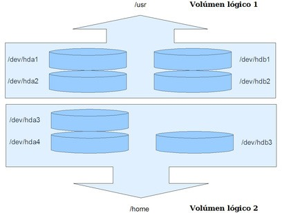


## Instalar un disco duro.

Vamos a instalar un disco duro en nuestra máquina. El disco duro puede ser tanto físico como virtual. En nuestro caso lo vamos a instalar un disco virtual en nuestra máquina. Para ello tendremos la máquina parada, para proceder a añadir el disco.
Seleccionaremos los "Settings" de nuestra máquina u "Opciones" y procederemos a añadir un nuevo componente hardware.

!!!note "Nota: Del mismo modo que lo hicimos anteriormente, pero en este crear un disco nuevo."


Una vez seleccionado el dispositivo "Hard Disk" o disco duro, vamos a proceder a su instalación. Seleccionamos el tipo de disco que nos recomienda, en este caso SCSI o SAS. Pulsamos "Next/Siguiente" y seleccionamos crear un nuevo disco.

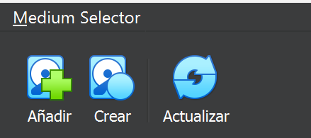

Le vamos a asignar 5 GB de espacio al nuevo disco y que se almacene en un solo fichero. Luego nos pedirá el nombre del fichero que va a almacenar los datos en la máquina virtual. En mi caso le he puesto el nombre de "Datos_1.vdi". Este fichero se almacenará en el directorio donde están todos los ficheros de configuración de la máquina virtual.

Ya tenemos el disco duro en nuestra máquina.

Ponemos la máquina en marcha e introducimos nuestro usuario/password, que en nuestro caso es: profesor/profesor.

Una vez dentro de nuestro sistema operativo nos pondremos como usuario root.

```
$ su -
```

!!!danger "Importante: No es lo mismo $ su root que $ su -root"

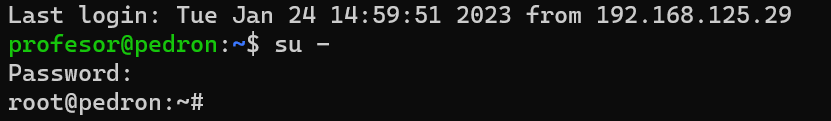

Vamos a empezar por ver si nuestro disco duro lo ha reconocido el sistema operativo.

```
# fdisk -l
```

Sí que lo ha reconocido, pero aparece sin una tabla de particiones válida. En nuestro caso lo ha denominado "/dev/sdb".

Vamos por buen camino. Ahora toca crear una partición en nuestro dísco duro "/dev/sdb", para ello vamos a usar el siguiente comando:

```
# fdisk /dev/sdb
```

En el se puede ver el inicio de la creación de la partición en nuestro disco duro.

* Pulsado la tecla "m", veremos todas las opciones diponibles.
* Nuestra primera orden será "n", para crear la partición.

Despues de pulsar "Intro", nos pedirá los siguientes datos:

* Tipo de partición: Eligiremos de tipo primaria →  "p".
* Número de partición: No tenemos ninguna partición con lo cual esta será la primera y por ellos elegimos →  "1".
  * Primer sector: Introduciremos el primer sector que nos indica en este caso → "2048". (Actualiza valor actualizado si es necesario)
  * Último sector: El que nos indica el sistema es este caso → "10485759". (Actualiza valor actualizado si es necesario)
* Para seleccionar el sistema de archivos soportados seleccionaremos "t" y luego "L".

Aquí nos	muestra todos los sistemas que	soporta;
* Nosotros seleccionaremos el número hexadecimal →  "83".

* Por último pulsamos "w" para guardar los datos y se creará la partición.

Si volvemos a ejecutar el comando:

```
# fdisk -l
```

Se puede ver que ya tenemos la partición creada, con los datos arriba definidos.

***Vamos manos a la obra.***

Ahora lo que vamos a hacer es crear un Volumen Lógico. Para ello voy a explicar un poco que se va a hacer. Realmente son 4 pasos, pero es importante el tener claro los conceptos:

* **Volumen físico**: Es la partición que vamos a utilizar para crear el volumen lógico.
* **Grupo de volúmenes**: Donde se alojarán cada uno de los volúmenes físicos que creemos. En nuestro caso lo denominaremos "almacen".
* **Volumen lógico**: La partición lógica que luego montaremos al directorio "/datos". Esta la denominaremos "mis_datos".

El sistema creará en el directorio **/dev/mapper/** un enlace simbólico, que será la unidad lógica que *formatearemos* y montaremos en el fichero *"fstab"*.

Primero debemos asegurarnos IMPORTANTE, que estemos como root.

Una vez verificado crearemos el volumen físico en este caso /dev/sdb1. Antes vemos las unidades montadas y no está la nuestra.

```
# df -h
```

Creamos el volumen físico. 

```
# pvcreate /dev/sdb1
```

Ahora pasamos a crear el Grupo de Volúmenes "almacen".

```
# vgcreate almacen /dev/sdb1
```

Creado el Grupo de Volúmenes "almacen", vamos a crear el Volumen Lógico "mis_datos" en el grupo "almacen". Le vamos a asignar los 5 GB de tamaño de nuestra partición, pero como siempre hay un poco que se pierde hay que poner un poco menos en nuestro caso 4,99G. IMPORTANTE si el idioma es "Español", el punto decimal es una ",", no un "."

```
# lvcreate almacen -L 4,99G -n mis_datos
```

!!!note "Nota: Pues ya tenemos nuestro LVM creado."

Para comprobar que está creado el nuevo dispositivo, nos vamos a el directorio:

```
# cd /dev/mapper 
# ls

```

Aparece el enlace "almacen-mis_datos"

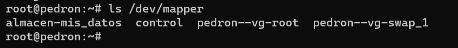


Ahora solo nos queda el formatearlo con el sistema de ficheros ext4 y luego montarlo en el fichero fstab.

```
# mkfs.ext4 /dev/mapper/almacen-mis_datos
```

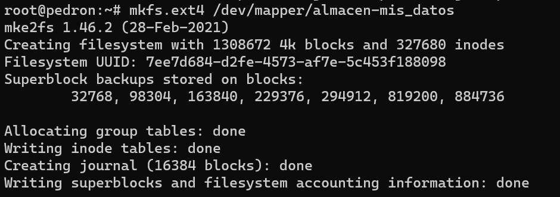

Como se puede ver en la imagen si hacemos un "ls -l", podemos ver que cada uno de los volumenes montados tiene asociado en "dev" una unidad, en nuestro caso la "dm-0"

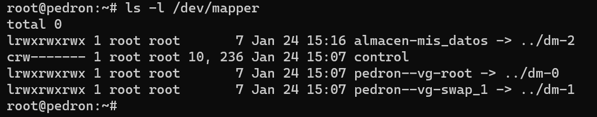

!!!warning "IMPORTANTE: Antes de montar de forma automática el fichero en el fichero **fstab**, es importante hacer una cópia del original."

Solo nos queda por último modificar el fichero fstab y comprobar al reiniciar que se ha montado automáticamente la partición.
El editor que usamos para editar ficheros es "nano", para poder editar el fichero fstab, se tiene que estar como root  o utilizar el comando "sudo", en nuestro caso ya estamos como root.

Hay que añadir la última línea. 

* Sistema de ficheros: He puesto el dispositivo directamente "/dev/dm-2", pero se podría poner "/dev/mapper/almacen- mis_datos".
* Punto de montaje: "/datos". El directorio que hemos creado para ello.
* Tipo: En nuestro caso  "ext4". Es el sistema con el que hemos formateado el volumen.
* Opciones: "defaults". Las opciones predeterminadas para ext4 son: rw, suid, dev, exec, auto, nouser, async.
* Dump: Utilizado por el programa dump («volcado») para decidir cuándo hacer una copia de seguridad. Dump comprueba la entrada en el archivo fstab y el número de la misma le indica si un sistema de archivos debe ser respaldado o no. La entradas posibles son 0 y 1. Si es 0, dump ignorará el sistema de archivos, mientras que si el valor es 1, dump hará una copia de seguridad. La mayoría de los usuarios no tendrán dump instalado, por lo que deben poner el valor 0 para la entrada *dump*. Yo he elegido "1".
* Pass: Utilizado por fsck para decidir el orden en el que los sistemas de archivos serán comprobados. Las entradas posibles son 0, 1 y 2. El sistema de archivos raíz («root») debe tener la más alta prioridad: 1 -todos los demás sistemas de archivos que desea comprobar deben tener un 2-. La utilidad fsck no comprobará los sistemas de archivos que vengan ajustados con un valor 0 en *pass*.

Crearemos una carpeta donde montaremos nuestro volumen lógico.

```
# mkdir /datos
# nano /etc/fstab

```

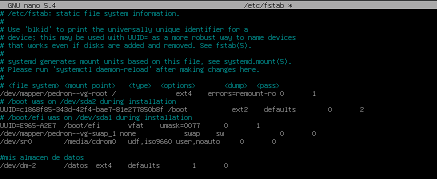

!!!note "Anotación: Quizás esta configuración **NOS** de un error, ***A BUSCAR UNA SOLUCIÓN!!***"

Guardamos el fichero, reiniciamos y comprobamos si está todo correcto con:

```
# df -h
```
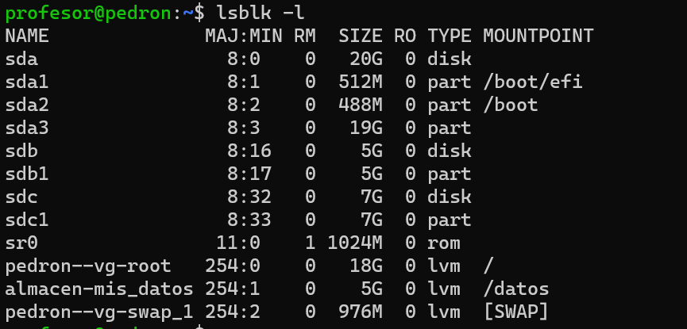


El volumen lógico tiene un enlace a la unidad"/dev/dm-2", veremos como la tenemos montada como;
 "/dev/mapper/almacen-mis_datos"


***Crearemos un fichero de prueba***

Arrancamos la máquina virtual y nos validamos.

Lo primero que vamos a hacer en ir al directorio "/datos", validarnos como "root" y luego crear el fichero "archivo.txt" y escribir un texto en  su interior, para ello utilizaremos el programa "nano". Los comandos utilizados:

```
$ su -

# touch archivo.txt 

# nano archivo.txt
```

Escribir el texto: "Mi primer texto en este volumen" 

```
# cat archivo.txt
```

Para poder ver el contenido guardado.

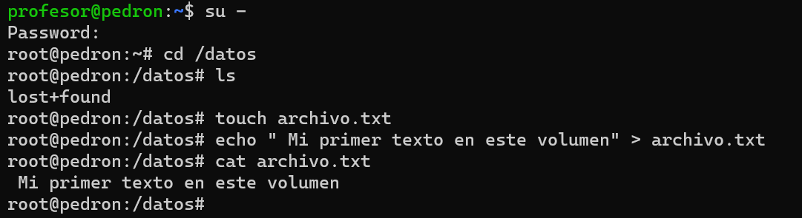

## Aumentar el volumen.Nuevo disco.

Aumentar el volumen, no tiene nada que ver con la báscula.
A lo que me refiero con aumentar el volumen es a que de repente aparece un disco duro por ahí escondido y queremos darle una utilidad. Una de las utilidades que le vamos a dar es la de aumentar nuestro volumen de 5 GB, sin perder información.
Lo que hemos encontrado es un disco duro de 7GB que vamos a añadir a nuestro volumen lógico "mis_datos". Para al final tener un volumen de 12GB compuesto por dos discos físicos.

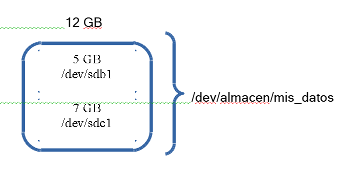{width=50%}

Lo primero que vamos a hacer es conectar nuestro disco duro a nuestro ordenador. En nuestro caso simplemente es añadir un **nuevo** disco duro de 7GB a nuestra máquina virtual. En mi caso le he denominado "Datos_2.vdi".

## Crear partición

Vamos a crear una partición en el nuevo disco.
Primero tenemos que ver como se denomina este nuevo disco, para saber que punto de montaje le ha dado Ubuntu. En este caso "/dev/sdbc".

Ejecutaremos 

```
# fdisk -l
```

A continuación realizaremos los mismos pasos que en el disco anterior de 5GB.

```
# fdisk /dev/sdbc → Para crear la partición.
```

@ Pulsamos n → Para añadir una nueva partición. 
@ Pulsamos p → Para indicar que es primaria.
@ Pulsamos 1 → Para indicar que es la primera.
@ Introducimos el primer y últimos sector de nuestro disco. @ En orden: Introducimos "t"
@ Pulsamos L → Para seleccionar el número de partición.

Como el caso anterior elegimos el código hexadecimal "83" que hace referencia a "Linux" y por último
@ Pulsamos w → Para guardar los cambios.

## Añadir a un volumen existente
Ya tenemos la partición ahora nos queda simplemente añadirla al grupo de volúmenes, al volumen lógico y ampliar el volumen.
Primero vamos a crear el volumen físico. 

```
# pvcreate /dev/sdc1
```

A continuación añadimos a nuestro grupo de volúmenes "almacen", el volumen físico. Este grupo ya existe.

```
# vgextend almacen /dev/sdc1
```

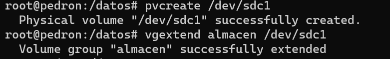

Ahora nos queda "extender" el volumen lógico. A este le añadimos el espacio de nuestro volumen físico "/dev/sdc1" que queramos. En nuestro caso le vamos a añadir los 7GB que contenía el disco. Si ha ido bién nos informará del nuevo tamaño de nuestro volumen lógico "mis_datos", que es de unos 12GB. Para hacer referencia a este volumen lógico voy a utilizar otro posible enlace en "/dev/almacen/mis_datos".

```
# lvextend -L +7G /dev/almacen/mis_datos
```

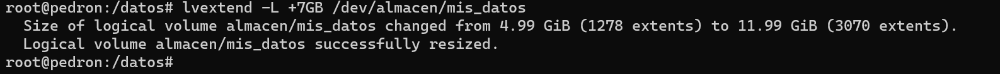

Bien, parece que ya está todo hecho, así que vamos a hacer una pequeña comprobación de que todo está bien, para ello ejecutamos nuestro comando.

```
# df -h
```

Y nos dará una sorpresa, que el punto de montaje sigue siendo de unos 5G, como se muestra en la imagen.


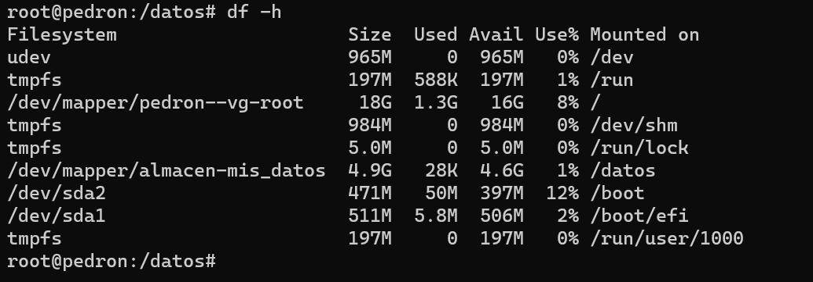

Lo que ha ocurrido es que, si bien el volumen ya cuenta con una mayor capacidad de almacenamiento, el sistema de archivos que se creó está limitando el tamaño del mismo. Por ello, es necesario extender el sistema de archivos existente. Este paso se realizará on-line, es decir, sin desmontar el volumen.


Vamos a realizar una serie de pasos, redimensionar el sistema de archivos, volver a comprobar los puntos de montajes y confirmar que el fichero que habiamos dejado al principio sigue ahí, es decir, la información no se ha borrado.

```
# resize2fs /dev/almacen/mis_datos

# df -h
# cat /datos/archivo.txt
```
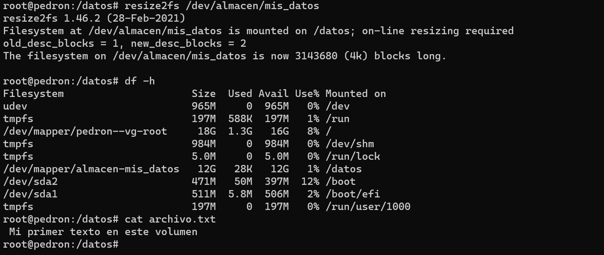

Vamos a ejecutar una serie de comandos para comprobar que todo está correcto y listo para el siguiente punto.

```
# lsblk -f → Para ver el árbol de volúmenes 

# vgs → Para ver los grupos de volúmenes

# lvs → Para ver los volúmenes lógicos y su tamaño.
```

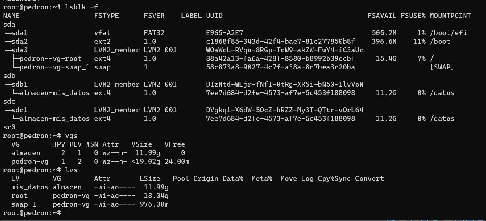

Por último vamos a cambiar en el fichero "/etc/fstab" el punto de montaje y vamos a dejar el de "/dev/mapper/almacen-mis_datos" en vez de "/dev/dm-0".

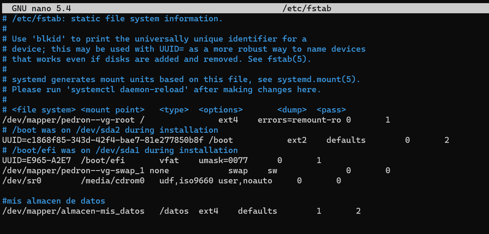


