# Configuración de la máquina virtual

A continuación vamos a configurar nuestra máquina virtual para la instalación de nuestro Linux Server.

Vamos a realizar la instalación con el hipervisor o VMM (Monitor de máquina virtual) Virtual Box

***Configurar***

Como en todas las máquinas virtuales vamos almacenar todos los ficheros en nuestro disco duro personal, ***NO*** en el disco duro local del equipo.

Para ello aparecerá la primera pantalla.

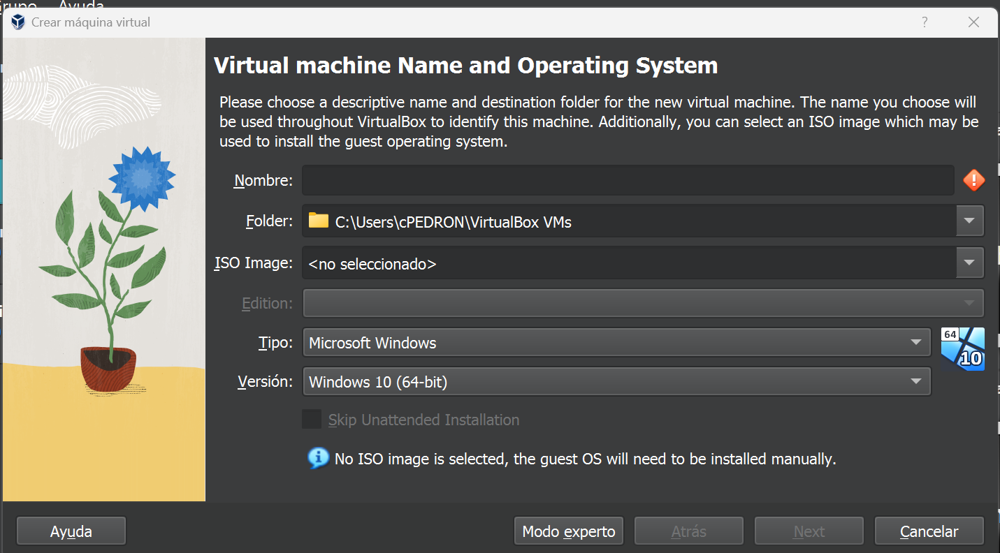

En esta pantalla seleccionamos el "Tipo" del sistema operativo que vamos a instalar en nuestro caso es Linux y la "versión" Debian, teniendo en cuenta la arquitectura de 32 o 64 bits.  
Aquí seleccionamos donde vamos a almacenar nuestra máquina virtual y que nombre va a tener. En mi caso la voy a llamar "Debian11_Server".

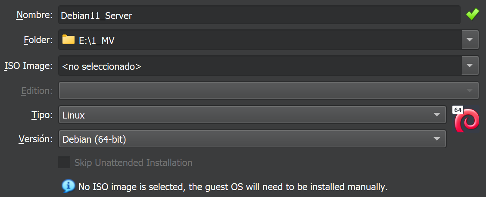

Continuamos configurando el número de procesadores y de núcleos que vamos a asignar a nuestra máquina virtual. Además indicaremos la cantidad de memoria RAM que le vamos a asignar a nuestra máquina virtual. 

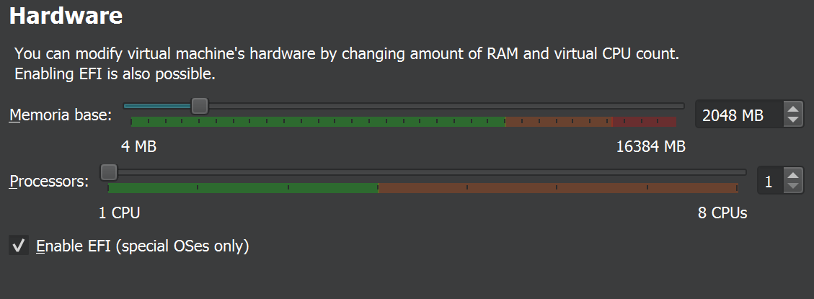

Posteriormente, nos solicita que indiquemos como vamos a tratar el disco duro donde se instale el SO. Seleccionamos crear un disco nuevo y el tamaño del disco duro que necesitemos (según necesitemos). En VirtualBox, el fichero del disco duro por defecto se denomina VDI, pero también permite crear el disco duro con el formato VMDK o VHD.

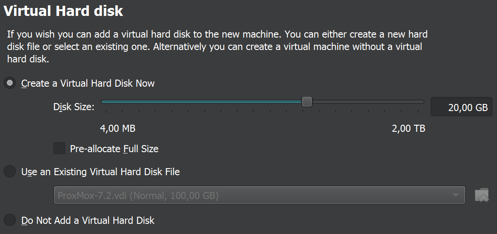

Por último aparece una pantalla con un resumen de las características de nuestra máquina virtual. Una vez comprobado que todo está Ok. Pulsamos "Finalizar" y pasaremos a la instalación del sistema operativo Debian.;

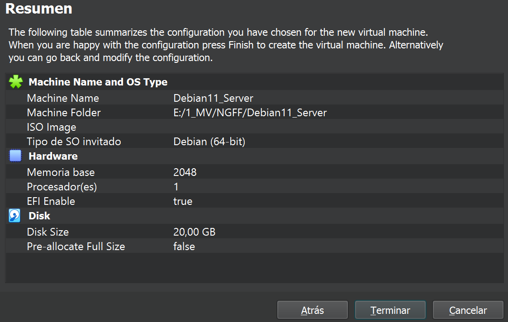

Dependiendo de la infraestructura que queramos virtualizar, deberemos decidir si nuestra MV dispondrá de *uno* o *dos* adaptadores de red.

En este paso vamos a configurar la conexión de la tarjeta de red de la máquina virtual. Vamos a elegir dos adaptadores el modo bridge y red interna.

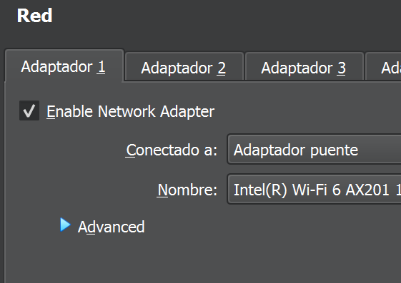

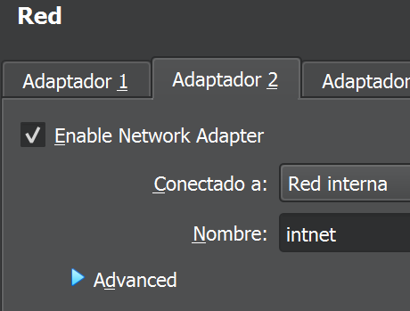

Por último vamos a configurar el dispositivo de almacenamiento externo (Disco duro). Primero tenemos que seleccionar el tipo de dispositivos de entrada/salida y tipo de disco duro. Simularemos un Controlador SAS y discos SAS. El "fichero" que simulará nuestro disco duro podemos reutilizar el creado al configurar de inicio la máquina virtual. Por defecto lo almacena en el mismo directorio que hemos elegido parar nuestra máquina virtual, pero lo podemos cambiar. 

!!!note "Nota: Realmente es el fichero más importante de la máquina virtual, ya que con este fichero podemos crear otras MV con el mismo disco duro"

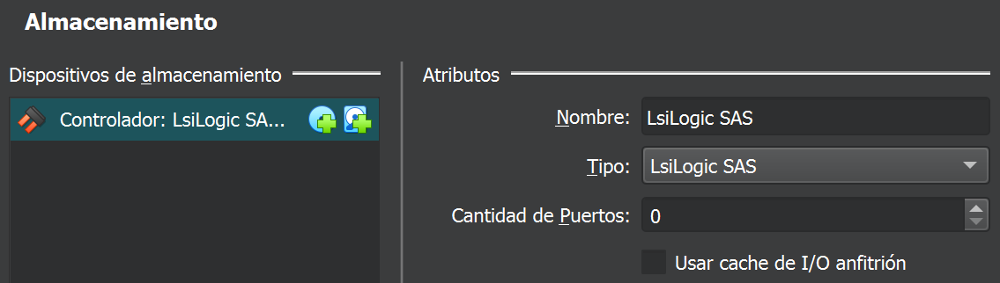  

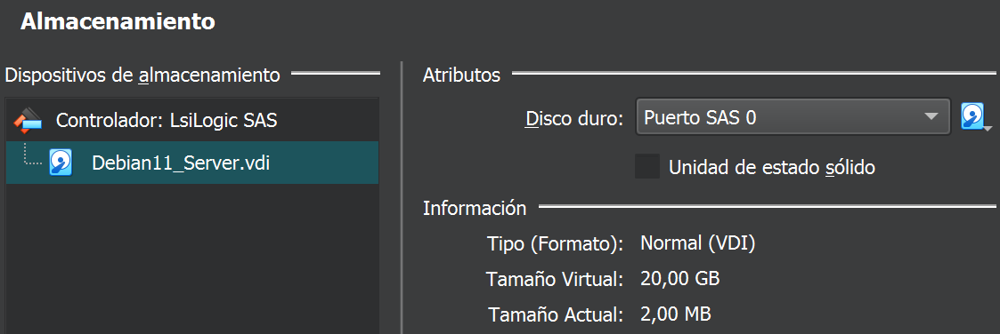 

Y para nuestra "unidad lectora óptica" dispondremos de un controlador SATA y una unidad óptica con puerto SATA.

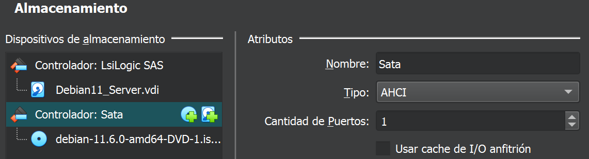 
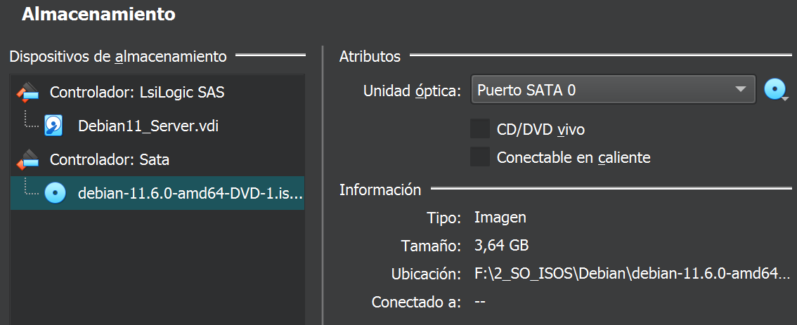 

Con esta parametrización podemos comenzar con la instalación de nuestro servidor Linux.

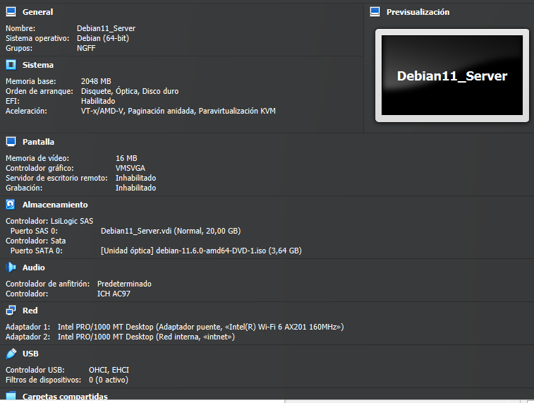

Máquina creada.