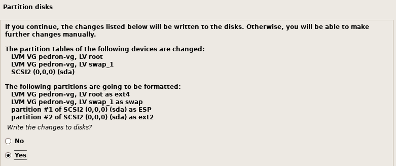
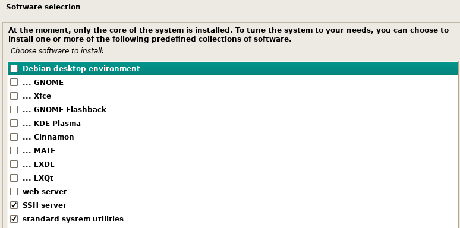

# Instalar Linux Server
Ya tenemos el entorno de nuestra máquina virtual creado o, si puedes disponer de ello, realiza la instalación en un PC físico.

En los puntos anteriores hemos descargado nuestra imagen del sistema operativo, solo nos queda enlazarla con la máquina virtual o PC físico y a empezar.

Primero e importante insertar el CD o imagen en la unidad CD/DVD de la máquina virtual.

Se puede grabar la imagen ISO en un CD o en un pendrive e insertar el CD de forma física.

Ya tenemos todo preparado, ahora solo quedan los pasos para la instalación. Pulsamos en el "Play" y a comenzar.

Ahora empieza la instalación, seleccionaremos la "Instalación con entorno gráfico" y seleccionamos el idioma en mi caso "Español", también admite "Català" o "English".

Como el teclado puede ser diferente según el país, nos pide que elijamos nuestra distribución de teclado, que claramente es "Español".

Una vez configurado el teclado comienza el proceso de instalación de nuestro equipo.

* Cargando componentes adicionales. 
* Detectando el hardware de red.
* Esperando la dirección local del enlace. 
* Intentando autoconfiguración de IPV6. 
* Configurando la red con DHCP.

Al detectar dos interfaces, nos preguntará que interfaz es la principal, seleccionamos la que tenga acceso a internet.

Para la configuración de la red nos pide el ***HOSTNAME***, nombre de nuestra máquina.
MUY IMPORTANTE: El nombre de la máquina será el objeto de red para buscar los recursos, por ello debe ser corto, en minúscula, sin espacios y sin caracteres especiales.  
En nuestro caso cada uno su ***APELLIDO***.

Cuando nos pregunte el nombre del ***DOMINIO***, indicaremos ***“carlospp.local”*** (modificar carlospp por vuestros datos, nombre y las iniciales de los apellidos).

Nos pedirá el **password** del ***ROOT***, en mi caso indico ***“Admin1!”***

El siguiente paso es asignar el nombre completo del ***usuario***, el nombre de usuario y password.
Para simplificar este paso el usuario completo es ***"Profesor Pedron"*** (Indicar y cambiar a vuestro nombre y 1er apellido) y el ***USUARIO/CONTRASEÑA*** es ***"profesor"*** (Indicar la contraseña alumno), en *minúsculas*.

Configuraremos nuestra zona horaria. Este punto es MUY IMPORTANTE debido a que va a establecer la fecha/hora del ordenador y se va a utilizar más adelante. Por ello confirmamos que está en nuestra zona horaria "Europa/Madrid" y continuamos. En caso de no ser así se procederá a cambiar.

Por último nos da la posibilidad de cifrar nuestra carpeta personal del usuario "profesor". En este caso no es necesario, pero es una buena opción en caso de que vaya a contener información muy valiosa.

Una vez definido todos los parámetros de nuestro sistema nos queda el particionado del disco. En este caso va a ser un proceso sencillo y guiado.
Vamos a elegir el esquema estándar de ***"Guiado - utilizar el disco completo y configurar LVM"***. Este esquema es el más aconsejado, porque nos permitirá en un futuro aumentar el tamaño del disco sin problemas.

Aviso de que nos va a borrar todos los datos en el disco que seleccionemos y nos muestra nuestro disco. Nos avisa que se va a grabar la tabla de particionado y que no hay vuelta atrás. En nuestro caso vamos a usar *todo el espacio disponible*.

Sí hemos seleccionado por hardware simular un sistema EFI, te pedirá la confirmación de la instalación.

Nos pedirá confirmación de los cambios.

Nos muestra los volumenes LVM que va a crear y sus nombre (Atención el volumen indica nuestro “apellido”), así como el sistema de archivos que va a utilizar "ext4".
Aceptamos y pasa a la creación, formateo y comienzo de la copia de ficheros.

**Comienza el proceso de instalación del sistema.**
Antes de comenzar la descarga de paquetes necesarios para la instalación del sistema nos pide si disponemos de **otro medio** de instalación, por ejemplo, otros CD/DVD, en nuestro caso indicaremos **“NO”**.

Para la instalación con la herramienta de gestión de paquetes no pregunta por el ***repositorio*** a utilizar, en nuestro caso, indicaremos ***SI*** y el mirror en España.

Si disponemos de algún servidor **proxy** para conectarnos a internet. En nuestro caso lo dejamos en blanco.

Nos da la posibilidad de instalar una serie de interfaces gráficas y una serie de aplicaciones para nuestro Linux. Entre los paquetes está el software ***"SSH server"***, que instalaremos junto a las utilidades ***standars*** y **SIN** entorno de escritorio.
Dejamos el paquete “standard system utilities” seleccionado.

Ahora continúa instalando programas.
Una vez instalados todos los programas, Debian puede indicarnos la necesidad de instalar el GRUB, es el sistema de arranque de linux. En nuestro caso ha detectado que no hay otro sistema y nos pide permiso para instalar GRUB en el registro principal del arranque. Seleccionamos que **SÍ** y continuamos.

Hemos terminado la instalación, ahora nos pide que quitemos el CD de instalación, en nuestro caso lo que vamos a hacer es en la unidad de CD/DVD, seleccionar la unidad física que está vacía. Si se hubiera hecho la instalación con un CD físico, nos tocaría sacarlo antes de continuar.

Instalación TERMINADA, el sistema se reinicia y comienza el arranque del sistema operativo Debian.

Cuando ha cargado todos los procesos nos pide el usuario y contraseña y podremos entrar.
Nada más entrar en el sistema nos muestra un mensaje de bienvenida en el que podemos ver páginas de ayuda.

***PROBLEMA!!!! Cómo apago el servidor?.***

